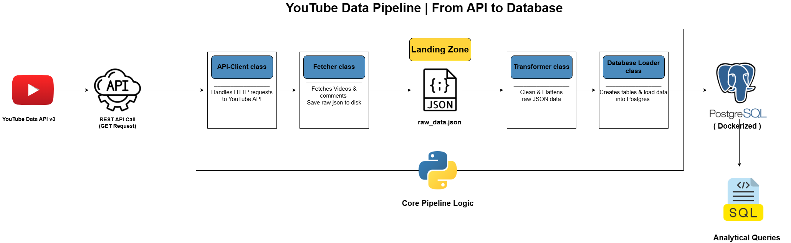

# YouTube Data Pipeline

A modular ETL pipeline that extracts video and comment data from the YouTube Data API v3, stores the raw API responses, transforms the data into an analysis-ready format, and loads it into PostgreSQL for querying and analysis.

--------------------------------------------------------------

# Architecture

    

-----------------------------------------------------------------

# ETL Workflow

The pipeline consists of five main stages:

1. **Extract**
   - Connect to the YouTube Data API v3
   - Fetch videos and comments from multiple channels

2. **Landing**
   - Store the raw API responses locally as JSON files
   - Preserve the original data before any processing

3. **Transform**
   - Flatten nested JSON structures
   - Clean and validate the data
   - Handle missing values
   - Prepare analysis-ready datasets

4. **Load**
   - Create PostgreSQL tables
   - Insert videos and comments into the database

5. **Analyze**
   - Execute SQL queries to generate insights

------------------------------------------------------------------

# Prerequisites

- Python 
- Postgres
- YouTube Data API v3 Key

You can create an API key here:

https://console.cloud.google.com

-----------------------------------------------

# Configure environment variables

Create a .env file in the project root.

YOUTUBE_API_KEY=your_api_key

DB_HOST=localhost
DB_PORT=5432
DB_NAME=youtube_db
DB_USER=your_db_user
DB_PASSWORD=your_db_password

# Database Schema

## videos

| Column | Type |
|---------|------|
| video_id | VARCHAR (PK) |
| title | TEXT |
| channel_id | VARCHAR |
| channel_name | VARCHAR |
| published_at | TIMESTAMP |
| description | TEXT |
| view_count | INTEGER |
| like_count | INTEGER |
| comment_count | INTEGER |

---

## comments

| Column | Type |
|---------|------|
| id | SERIAL (PK) |
| video_id | VARCHAR (FK) |
| author | VARCHAR |
| text | TEXT |
| published_at | TIMESTAMP |
| like_count | INTEGER |

---

#  youtube Channels

1- beIN SPORTS     
2- Nat Geo Abu Dhabi      
3- Joe HaTTab    
4- BBC News  

